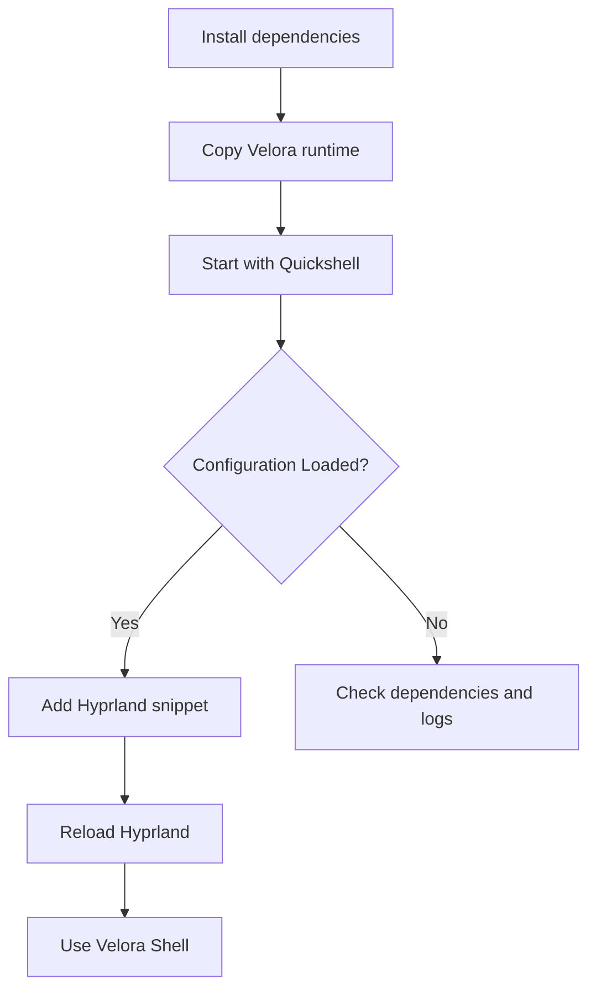

# ᐯᕮᒪOᖇᗩ Sᕼᕮᒪᒪ 

## Velora Shell is a minimalist and practical Linux desktop shell built with Quickshell. 
**Autor:** [@OshiroAka](https://github.com/OshiroAka)


## System

> Velora Shell is a minimalist and practical desktop shell built with Quickshell for Hyprland.
>
> > Designed for Arch Linux-based systems, it provides a clean, lightweight, and customizable user experience.
## Installation
*Copy the repository and start the installer.*
``` 
git clone https://github.com/OshiroAka/Velora-Shell 
cd ~/Velora-Shell ./install.sh
```
## Dependencies

_For manual installation._

| Tool | Purpose |
| ---- | ------- |
| `quickshell` | Runs the shell |
| `hyprland` | Wayland compositor |
| `rsync` | Copies the runtime cleanly |
| `playerctl`, `wpctl`, `nmcli` | Media, audio and network controls |
| `mako`, `brightnessctl`, `cava` | Notifications, brightness and visualizer |
| `python-pywal16` | Wallpaper color generation |
| `easyeffects`, `calf`, `lsp-plugins-lv2`, `zam-plugins-lv2` | Audio effects |
| `pipewire-pulse`, `wireplumber` | Audio session support |
| `xdg-utils` | Opens files and external links |
| `awww`, `mpvpaper`, `linux-wallpaperengine-git` | Wallpaper backends |

For Arch Linux-based systems:

```bash
paru -S --needed quickshell hyprland rsync playerctl wireplumber networkmanager mako brightnessctl cava python-pywal16 easyeffects calf lsp-plugins-lv2 zam-plugins-lv2 pipewire-pulse xdg-utils awww mpvpaper linux-wallpaperengine-git
```

## Manual Installation

Copy the Velora Shell runtime into the Quickshell config directory:

```bash
mkdir -p ~/.config/quickshell/velora-shell
rsync -a --delete ~/Velora-Shell/"Velora Shell"/ ~/.config/quickshell/velora-shell/
```

Start Velora Shell:

```bash
qs -d -p ~/.config/quickshell/velora-shell
```

Validate the config:

```bash
timeout 8s qs -p ~/.config/quickshell/velora-shell --no-color --log-times
```

Expected result:

```text
Configuration Loaded
```

## Hyprland Integration

Create a Velora snippet:

```bash
nano ~/.config/hypr/velora-hyprland.conf
```

Paste:

```conf
exec-once = env QS_NO_RELOAD_POPUP=1 QS_DROP_EXPENSIVE_FONTS=1 QSG_RENDER_LOOP=threaded qs -d -p ~/.config/quickshell/velora-shell

layerrule = blur on, match:namespace ^velora-shell($|-.*)
layerrule = blur_popups on, match:namespace ^velora-shell($|-.*)
layerrule = ignore_alpha 0.02, match:namespace ^velora-shell($|-.*)

bind = SUPER, K, exec, qs ipc -p ~/.config/quickshell/velora-shell call velora topWallpaper
bind = SUPER, W, exec, qs ipc -p ~/.config/quickshell/velora-shell call velora search
bind = SUPER, L, exec, ~/.config/quickshell/velora-shell/scripts/velora-lock
```

Then include it in `~/.config/hypr/hyprland.conf`:

```conf
source = ~/.config/hypr/velora-hyprland.conf
```

Reload Hyprland:

```bash
hyprctl reload
```

## Installation Flow



## Useful Commands

```bash
qs list --all
qs ipc -p ~/.config/quickshell/velora-shell show
qs kill -p ~/.config/quickshell/velora-shell
qs -d -p ~/.config/quickshell/velora-shell
```

